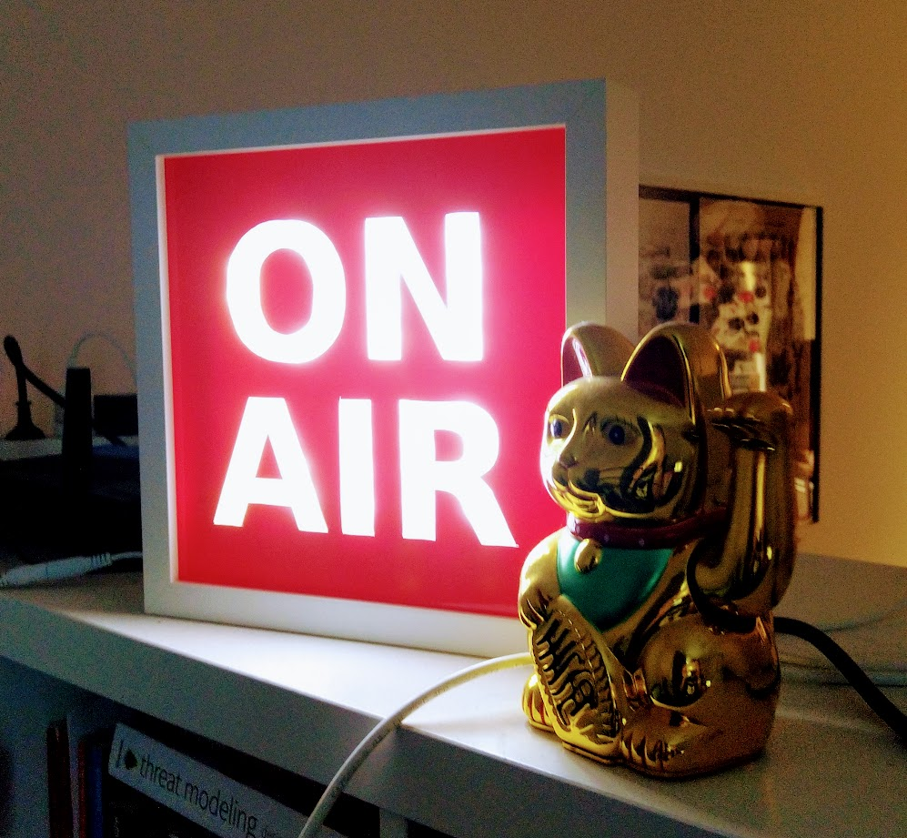

# On Air



Connects the webcam of my computer to my "on-air" sign. It toggles our cheap wifi lamp dongle thingy (https://github.com/vikstrous/zengge-lightcontrol) on or off, based on whether or not my webcam is active.

IP and device file are hardcoded for now, because I'm too lazy to make it into configuration.

## Install

Running the application requires that you have `inotifywait` and `fuser` installed. Also Linux, most likely 🐧

Golang is needed to compile it.

```sh
$ make
$ make install # installs the application
$ make install-service # installs application as a service
```

## Usage

```
Controls the on-air sign in our apartment

Usage:
  on-air [command]

Available Commands:
  daemon      Continuously checks for webcam usage and toggles the light
  off         Turns off the light
  on          Turns on the lamp

Flags:
      --config string   config file (default is $HOME/.on-air.yaml)
  -h, --help            help for on-air

Use "on-air [command] --help" for more information about a command.
```

## Todo / Ideas

- [ ] More Testing IRL
- [ ] Support for multiple computers on the same local network
- [ ] detect microphone usage
